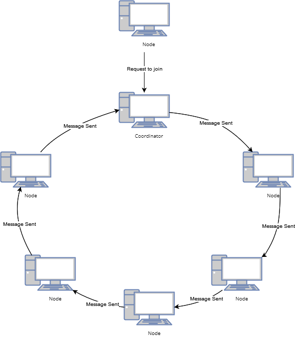
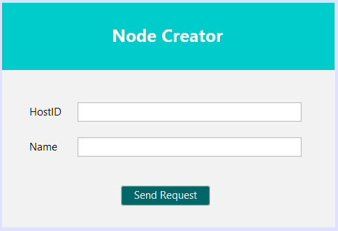
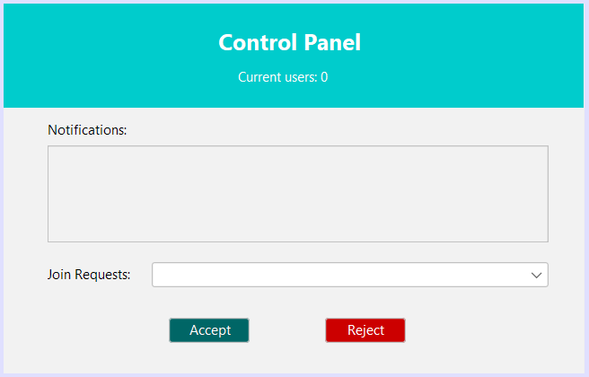
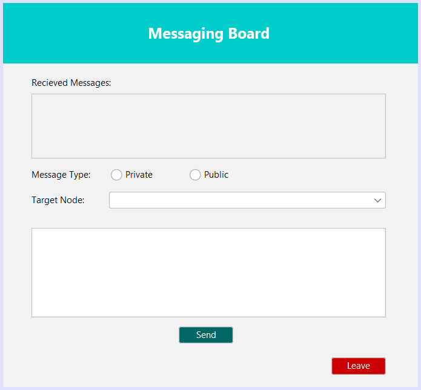

# P2P Ring Documentation

This is the documentation for the P2P-Ring-Topology project, a communication system built on a peer-to-peer (P2P) architecture with a ring topology (obvious I know).  It was imagined as a circle of devices where each one acts as both a sender and receiver of information.  Messages flow through this ring, reaching all participants or a specific recipient, fostering a collaborative and decentralized communication experience.

#### Last Updated: March 29th, 2024
## Table of Contents

1. [Introduction](#introduction)
2. [Installation](#installation)
3. [Usage](#usage)
4. [System Design Architecture](#architecture)
   - [Topology](#topology)
   - [Coordinator](#coordinator)
   - [Communication](#communication)
5. [GUI Design](#gui)
   - [Create Node UI](#createui)
   - [Coordinator Control Panel UI](#controlui)
   - [Node UI](#nodeui)
6. [Distributed System  Functions](#distributed)
7. [Legality](#legality)
  

<a name="introduction"></a>
## Introduction 

This system utilizes peer-to-peer architecture utilizing a ring topology with each node acting as both a client and a server, forwarding messages to their successor within the ring until they reach all nodes or their desired target.

**Key Features:**

- **Peer-to-Peer Architecture with Ring Topology**: This system operates without a central server, with nodes acting as both clients and servers. They communicate by forwarding messages along a virtual ring until it reaches all nodes or the desired recipient.

- **Coordinator Election**: The first node joining the ring becomes the coordinator. It has additional responsibilities like approving or rejecting new nodes joining the network.

- **Public and Private Messaging**: By default, messages are public and travel across the entire ring. Nodes can switch to private messaging mode to send encrypted messages to a specific recipient using their port number.

<a name="installation"></a>
## Installation

Make sure you have [Netbeans](https://netbeans.apache.org/front/main/download/index.html) downloaded if you haven't already.
Follow these steps to download and run the application:
   
```bash
git clone https://github.com/Sambonic/P2P-Ring-Topology 
```
```bash
cd P2P-Ring-Topology 
```
**Note**: this system runs on Apache Netbeans IDE 16, you may need to readjust source format of the project file.

<a name="usage"></a>
## Usage

1. Simply open the project using Netbeans (or your preferred IDE).
2. Go to the "Classes" package.
3. Run the "Main" file.

<a name="architecture"></a>
## System Design Architecture
System design architecture is essentially the blueprint for how a system will be built. It defines the overall structure, components, and interactions that make the system function. Here's the overall architecture of the system:

<a name="topology"></a>
## Topology



- **Decentralization**: There's no single point of failure. Unlike traditional client-server systems, where a server crash disrupts the entire network, in P2P, all nodes share the responsibility. If one node goes down, others can still communicate.

- **Scalability**: The system can easily grow as more users join. Adding new nodes simply adds another link in the ring.

- **Efficiency for Messages**: Broadcasting messages is efficient. Each node only needs to forward the message once to its neighbor, and it propagates throughout the ring.

  
<a name="coordinator"></a>
## Coordinator
There are several reasons why this system designates the first node as the coordinator while keeping it within the ring structure:

- **Simplicity**: This design avoids the need for a separate server process to manage the ring. Everything remains within the P2P network itself.

- **Distributed Control**: There's no single point of control for the entire network. If the coordinator fails, another node can take over, maintaining overall functionality.

However, there are also trade-offs to consider:

- **Single Point of Failure**: While the system was built on the premise of decentralization, the coordinator failing can impact new nodes joining or overall message routing efficiency until a new coordinator is elected.

- **Increased Load on Coordinator**: The coordinator might experience higher load compared to other nodes due to managing join requests and potentially additional tasks.

<a name="communication"></a>
## Communication

- **Send Public Message**: Upon creation, each node’s communication mode is set to public messaging by default. When a node sends a public message it is sent from successor to another along the ring until it eventually reaches all nodes.

- **Send Private Message**: When a node chooses private communication mode, a dropdown menu is enabled that allows the node to choose another node to send the message to. Once both the recipient and the message are decided, send button may be clicked. The message then is automatically encrypted by the sender using the receiver's port number. The encrypted message travels through the ring, appearing like gibberish to all other nodes except the intended recipient who upon receiving the message, decrypts it using his or her own port number.

<a name="gui"></a>
## GUI Design
The system utilizes three GUIs for user interaction.  New users establish a node and request to join the network through a simple interface.  The coordinator has a separate control panel to manage join requests.  Lastly, there is the main node UI that allows users to send and receive messages.

<a name="createui"></a>
## Create Node UI



In this GUI, the Nodes are established and send a request to join the ring. If it’s the first node to send a request, it is automatically promoted to the role of coordinator. If it isn’t, then the request is sent to the coordinator’s control panel where he or she gets to control how to process said request.

<a name="controlui"></a>
## Coordinator Control Panel UI



Upon establishing the first node, the coordinator, the control panel GUI pops up. There, he or she receives the requests and decides to either accept them into the ring or reject them. Whether it’s acceptance or not, the decision will appear in the notifications tab. Additionally,the notifications tab receives info when a node leaves the ring and automatically updates the ring and the current number of users online.

<a name="nodeui"></a>
## Node UI



The node GUI where all the main functionalities of the system take place. There is the “received messages” tab where messages sent across the network are displayed. If the message is private and the node is the recipient or sender, it will display as normal with “(Private)” displayed next to it, otherwise it will display the encrypted message. There are two radio buttons to choose the type of message the user wants to send. The “target node” drop-down box is only enabled if the private radio box is selected. Lastly, there’s the actual message box where the message is written to be sent.

<a name="distributed"></a>
## Distributed System Functions

- **Scalability**: 
  - Advantages:
The system was designed to be scalable and dynamic as it is not limited to any specific number of nodes and any newly added nodes integrate seamlessly to the ring structure of the network.
  - Disadvantages:
As the number of nodes increases, the potential of thread overhead and concurrency issues rises significantly leading to unexpected behaviors. Additionally, rapid growth in the ring structure could also introduce message latency issues since each node receival of said message relies on it being passed around in a sequential manner from one node to the next.


- **Fault Tolerance**: 
  - Disadvantages:
In spite of using P2P as a decentralized architecture, the ring implementation causes each node to be prone to single point of failure since there was no exception handling mechanism implemented in the case of a node failing and disrupting the communication line among the other nodes, resulting in the entire chain ring failing altogether. 

<a name="legality"></a>
## Legality
The MIT License (MIT)

This project is licensed under the MIT License - see the LICENSE file for details.

Permission is hereby granted, free of charge, to any person obtaining a copy of this software and associated documentation files (the "Software"), to deal in the Software without restriction, including without limitation the rights to use, copy, modify, merge, publish, distribute, sublicense, and/or sell copies of the Software, and to permit persons to whom the Software is furnished to do so, subject to the following conditions:

The above copyright notice and this permission notice shall be included in all copies or substantial portions of the Software.

THE SOFTWARE IS PROVIDED "AS IS," WITHOUT WARRANTY OF ANY KIND, EXPRESS OR IMPLIED, INCLUDING BUT NOT LIMITED TO THE WARRANTIES OF MERCHANTABILITY, FITNESS FOR A PARTICULAR PURPOSE, AND NONINFRINGEMENT. IN NO EVENT SHALL THE AUTHORS OR COPYRIGHT HOLDERS BE LIABLE FOR ANY CLAIM, DAMAGES, OR OTHER LIABILITY, WHETHER IN AN ACTION OF CONTRACT, TORT, OR OTHERWISE, ARISING FROM, OUT OF, OR IN CONNECTION WITH THE SOFTWARE OR THE USE OR OTHER DEALINGS IN THE SOFTWARE.
